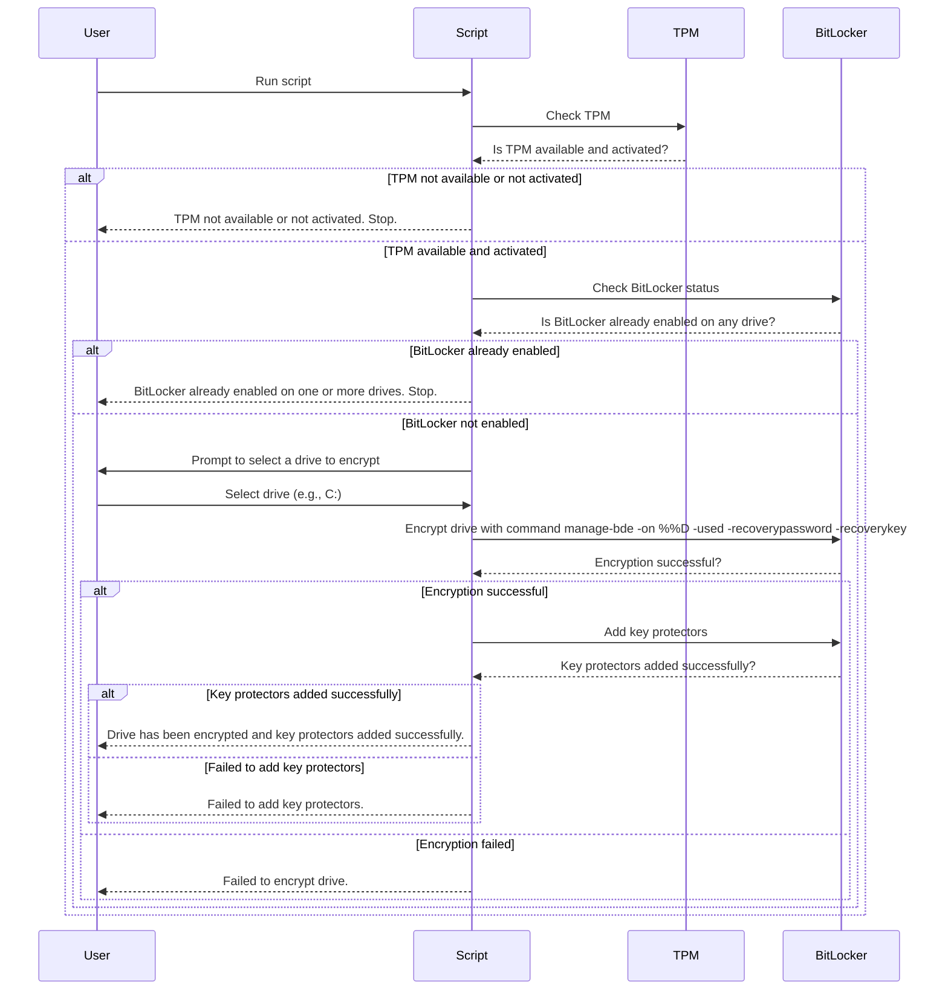

```mermaid
sequenceDiagram
    participant User
    participant Script
    participant TPM
    participant BitLocker

    User->>Script: Run script
    Script->>TPM: Check TPM
    TPM-->>Script: Is TPM available and activated?
    alt TPM not available or not activated
        Script-->>User: TPM not available or not activated. Stop.
    else TPM available and activated
        Script->>BitLocker: Check BitLocker status
        BitLocker-->>Script: Is BitLocker already enabled on any drive?
        alt BitLocker already enabled
            Script-->>User: BitLocker already enabled on one or more drives. Stop.
        else BitLocker not enabled
            Script->>User: Prompt to select a drive to encrypt
            User->>Script: Select drive (e.g., C:)
            Script->>BitLocker: Encrypt drive with command manage-bde -on %%D -used -recoverypassword -recoverykey
            BitLocker-->>Script: Encryption successful?
            alt Encryption successful
                Script->>BitLocker: Add key protectors
                BitLocker-->>Script: Key protectors added successfully?
                alt Key protectors added successfully
                    Script-->>User: Drive has been encrypted and key protectors added successfully.
                else Failed to add key protectors
                    Script-->>User: Failed to add key protectors.
                end
            else Encryption failed
                Script-->>User: Failed to encrypt drive.
            end
        end
    end
```