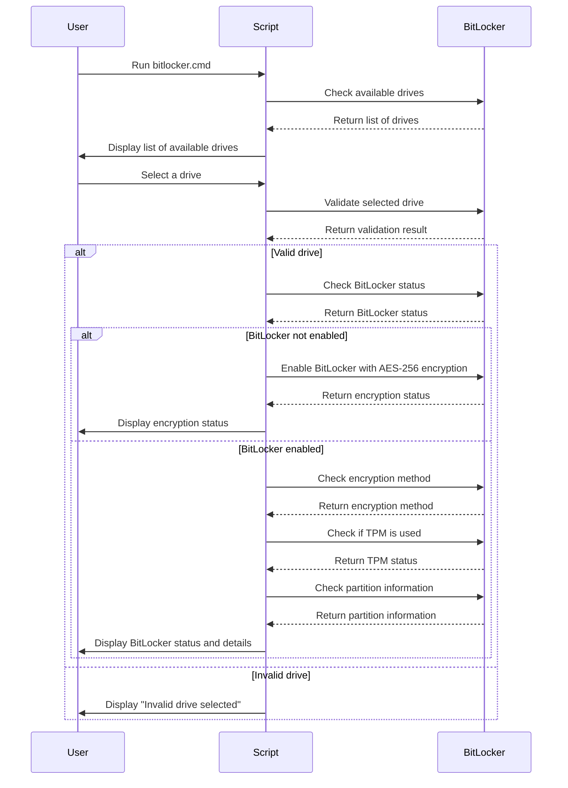

<h1 align="center"> BitLocker Tools </h1>

  
  

  
  
  

## Introduction

The BitLocker Tools provide a set of utilities to manage BitLocker encryption on Windows systems. These tools help you enable, disable, and manage BitLocker encryption on your drives with ease.

## Workflow

